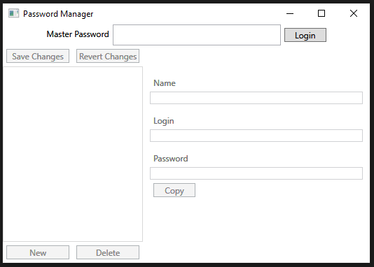

# Password-Manager

A simple password manager written in app written in c# with wpf.

This project demonstrates how dependency injection can be used to simplify construction of complex objects, and how asynchronous programming can preventlocking up the UI while working on an intensive task.

## Features

- Secure login with a master password
- Create, update and delete stored passwords
- Save changes back to an encrypted database

## Usage

After logging in with your master password:

1) Select a password entry from the list on the left or click New.
2) Edit its details on the right panel.
3) Use the Save Changes button to save the data to an encrypted database.

## Installation

Build and run using Visual Studio 2022 (or later).  

## Screenshot

